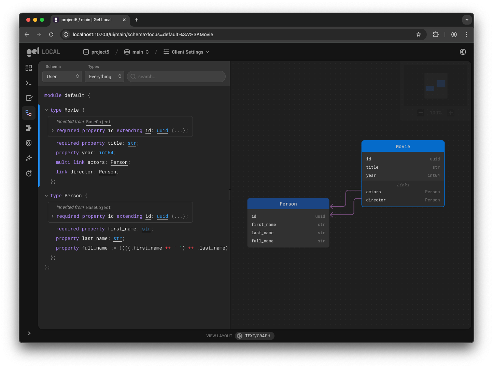

# project5

Using pre-created scripts to run the native queries.

```shell
gel project init
cp ../project4/dbschema/default.gel dbschema/default.gel
gel migration create
gel migrate
gel migration status
```

```shell
gel query -f scripts/insert.edgeql
{"id": "e47154d6-91eb-11f0-9d42-b33e2dafa754"}
{"id": "e47a1aa8-91eb-11f0-9d42-57404e585476"}
{"id": "e47a1aa8-91eb-11f0-9d42-57404e585476"}
{"id": "e47fadce-91eb-11f0-af9d-136477285ad2"}
{"id": "e481b38a-91eb-11f0-9d42-4f1e1df68c52"}
{"id": "e483c2ba-91eb-11f0-9d42-5b764246708e"}
{"id": "e483e22c-91eb-11f0-af9d-cf2515e51181"}
{"id": "e485ec52-91eb-11f0-9d42-5723423b5ad8"}
```

```shell
gel query -f scripts/select_movie.edgeql
{"title": "Blade Runner 2049", "year": 2017}
{"title": "Dune", "year": null}
{"title": "Arrival", "year": 2016}
```

```shell
gel query -f scripts/select_person.edgeql
{"first_name": "Denis", "last_name": "Villeneuve"}
{"first_name": "Harrison", "last_name": "Ford"}
{"first_name": "Ana", "last_name": "de Armas"}
{"first_name": "Ryan", "last_name": "Gosling"}
{"first_name": "Jason", "last_name": "Momoa"}
{"first_name": "Oscar", "last_name": "Isaac"}
{"first_name": "Zendaya", "last_name": null}
```

```shell
gel query -f scripts/select_link.edgeql
```

```json lines
{"title": "Blade Runner 2049", "year": 2017, "director": {"first_name": "Denis", "last_name": "Villeneuve"}, "actors": [{"first_name": "Harrison", "last_name": "Ford"}, {"first_name": "Ana", "last_name": "de Armas"}, {"first_name": "Ryan", "last_name": "Gosling"}]}
{"title": "Dune", "year": null, "director": null, "actors": []}
{"title": "Arrival", "year": 2016, "director": null, "actors": []}
```

```shell
gel ui
```


